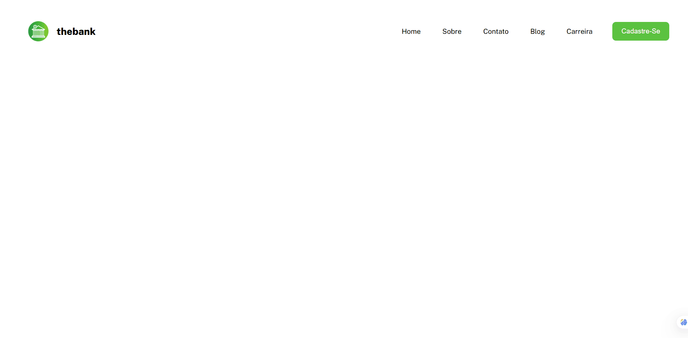
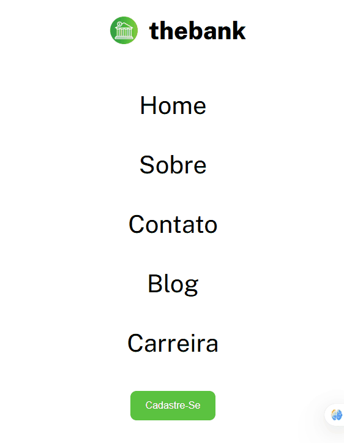

# Projeto Menu Thebank

Este projeto é um exercício prático proposto pelo curso **DevQuest**, e consiste na criação de um cabeçalho de navegação responsivo para uma empresa fictícia chamada "Thebank". O foco foi desenvolver um componente visualmente agradável e funcional, utilizando apenas HTML e CSS, que se adapta a diferentes tamanhos de tela, desde desktops até dispositivos móveis.

## 📝 Índice

- [Visão Geral](#visão-geral)
  - [Captura de Tela](#captura-de-tela)
- [Meu Processo](#meu-processo)
  - [Construído Com](#construído-com)
- [Estrutura de Arquivos](#estrutura-de-arquivos)
- [Como Usar](#como-usar)
- [Autor](#autor)


---

## Visão Geral

O objetivo foi construir um cabeçalho limpo e moderno, contendo o logotipo da empresa e um menu de navegação. O componente é totalmente responsivo, transformando o layout horizontal do menu em um layout vertical em telas menores para garantir uma ótima experiência de usuário em qualquer dispositivo.

### Captura de Tela

*Visualização em Desktop*


---

*Visualização em Dispositivo Móvel*<br>



---

## Meu Processo

### Construído Com

Este projeto foi construído utilizando tecnologias e técnicas web fundamentais.

-   **Estrutura Semântica HTML:** Para organizar o conteúdo de forma clara e acessível.
-   **CSS Flexbox:** Utilizado para criar o layout flexível e alinhamento dos itens do cabeçalho.
-   **CSS Variables:** Para manter a consistência de cores e fontes (`variable.css`).
-   **Design Responsivo (Media Queries):** Para adaptar o layout do menu para telas de 768px, 576px e 375px.
-   **Efeitos de Hover:** Para fornecer feedback visual interativo nos links e no botão.

---

## Estrutura de Arquivos

A estrutura de arquivos do projeto foi organizada para separar o conteúdo (HTML), a estilização (CSS) e os recursos (imagens).

```
menu-thebank/
|
├── src/
|   ├── css/
|   |   ├── reset.css
|   |   ├── variable.css
|   |   └── style.css
|   |
|   └── image/
|       ├── logo.png
|       ├── favicon-32x32.png
|       ├── menu-desktop.gif
|       └── menu-mobile.gif
|
├── index.html
|
└── README.md
```

---

## Como Usar

Para visualizar este projeto localmente, siga estes passos:

1.  **Baixe ou Clone o Repositório:**
    ```bash
    git clone <url-do-seu-repositorio>
    ```

2.  **Navegue até o Diretório do Projeto:**
    ```bash
    cd menu-thebank
    ```

3.  **Abra o arquivo `index.html`:**
    Abra o arquivo `index.html` no seu navegador para ver a aplicação.


## Autor
Desenvolvido por **[Vinicius Eduardo Morais Creso]**, um desenvolvedor em formação.

[](https://www.linkedin.com/in/seu-usuario/)

[](mailto:seu-email@exemplo.com)


